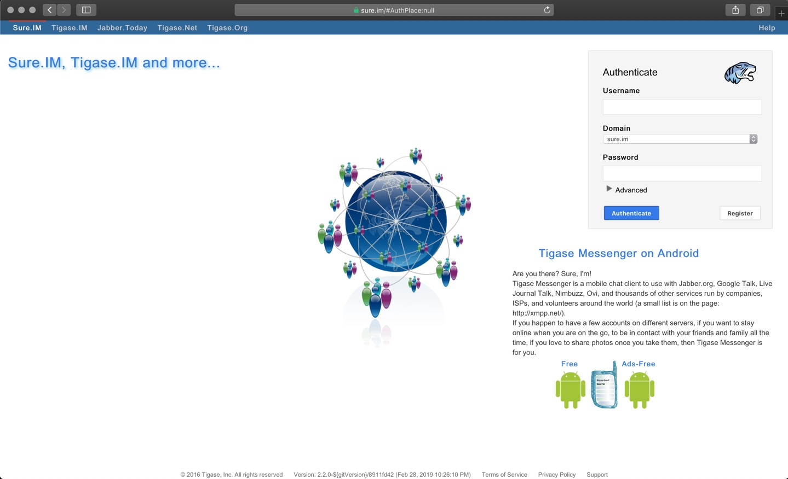

 /statusIcon)


# Tigase.IM Web Client

Tigase XMPP Web Client. It is based on Tigase [JaXMPP library](https://github.com/tigaseinc/jaxmpp). A live demo is available at the http://tigase.im and by default connects to our public tigase.im installation.

# Features

* RFC 6120 - XMPP CORE
* RFC 6121 - XMPP IM
* WebSocket and BOSH
* Message archive support for access to your old chat history form the server.
* Good MUC support so you can be in a group chat when you have access to a web browser.
* PubSub support for publishing to your PubSub nodes directly from a web browser.

# Support

When looking for support, please first search for answers to your question in the available online channels:

* Our online documentation: [Tigase Docs](https://docs.tigase.net/)
* Our online forums: [Tigase Forums](https://help.tigase.net/portal/community)
* Our online Knowledge Base [Tigase KB](https://help.tigase.net/portal/kb)

If you didn't find an answer in the resources above, feel free to submit your question to either our 
[community portal](https://help.tigase.net/portal/community) or open a [support ticket](https://help.tigase.net/portal/newticket).

# Downloads

Binaries can be downloaded from our [Maven repository](https://maven-repo.tigase.net/#artifact/tigase.sure.web/tigase-web-ui)

You can easily add it to your project by including it as dependency:

```xml
<dependency>
  <groupId>tigase.sure.web</groupId>
  <artifactId>tigase-web-ui</artifactId>
  <version>2.2.0</version>
</dependency>
```

# Compilation 

It's a Maven project therefore after cloning the repository you can easily build it with:

```bash
mvn -Pdist clean install
```

# License

 Official <a href="https://tigase.net/">Tigase</a> repository is available at: https://github.com/tigase/sureim/.

Copyright (c) 2004 Tigase, Inc.

Licensed under AGPL License Version 3. Other licensing options available upon request.
